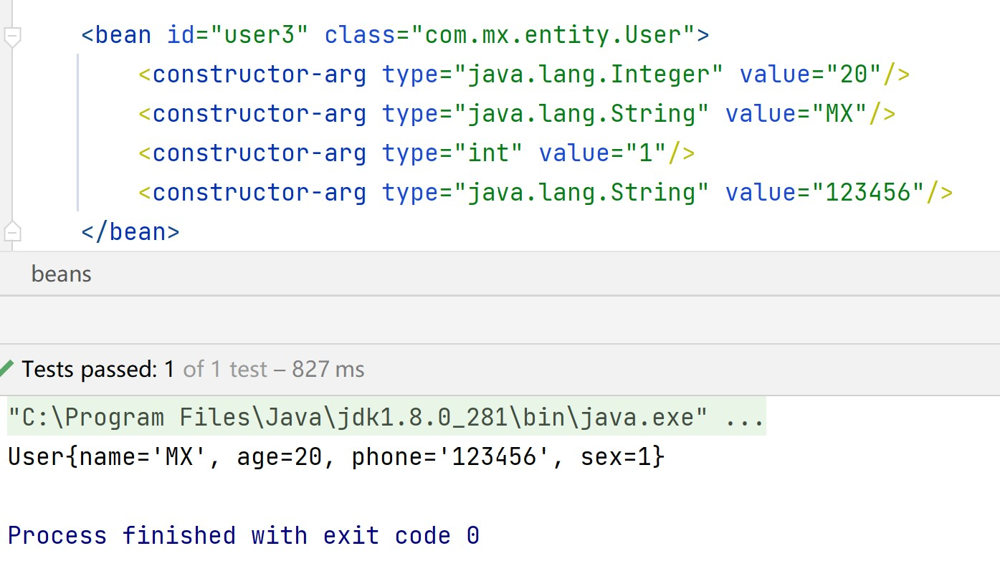
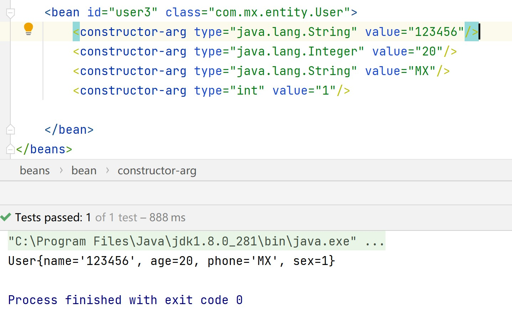
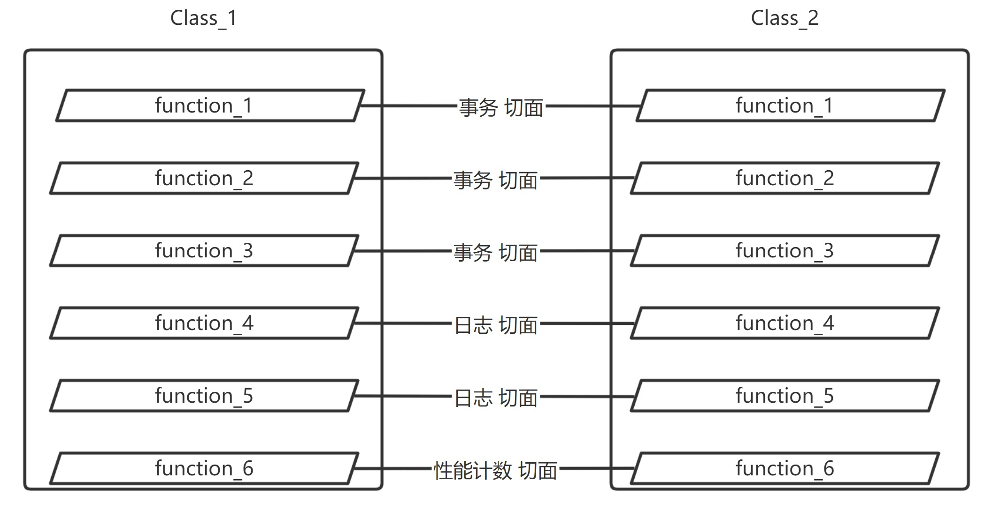
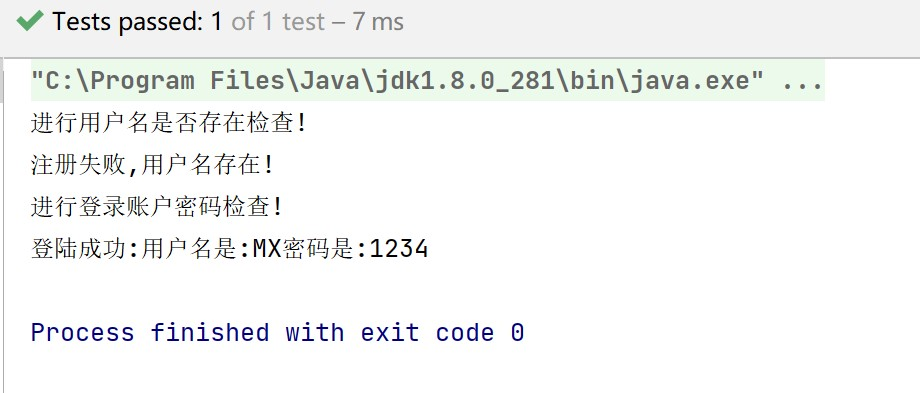

# Spring

## 什么是Spring

&emsp;&emsp;Spring是当下最主流的开源企业应用开发框架（现在你只需要知道这是个开发框架，还没到深究它是个什么框架的时候），其最初由一位名为Rod Johnson的程序员在2002年提出并建立， 初指是为了解决EJB（企业JavaBeans）开发的复杂性和软件开发中代码的耦合性，想方设法让JEE开发变得更加简单，令任何人都可以轻松的使用Spring框架进行JEE开发。

&emsp;&emsp;Spring是一个从实际开发中剥离出来的框架，因此Spring已经完成了开发中大量的相似步骤，留给开发者的工作仅仅是完成特定应用的特定部分，极大的提高了开发效率，从简单易用的角度出发，Spring不仅可以用于服务器开发，还可以用于任何Java程序的开发。

&emsp;&emsp;上头这段解释挺晦涩难懂的，但你在网上能看到百分之90的人都这么写，搞得刚入门的小程序员研究了半天也没研究明白Spring到底是个啥。其实对于Spring最通俗的解释就是，当你的程序需要使用数据库，而你又不想写那啰嗦的JDBC工具类时。欸嘿，这个时候我们就可以使用Spring了，Spring里头集成了JDBC操作，你可以使用简单的几条语句调用Spring集成的JDBC操作，Spring一行代码换十行，这波极限一换多它不亏。再或者，~~你想创建个对象，欸嘿，你没对象~~，啊不对，是你要new一个对象时，你需要写：

```java
Object ob=new一个Object();
```

但是你在Spring中可以这么写：

```xml
<bean id="ob" class="com.mx.entity.Object"/>
```

来进行对象的创建，顺带说一句，Spring里头有一个东西叫bean，这个bean到处都是，这个bean它就是，~~你没有的~~对象~~哈哈哈哈哈嗝~~。其实这么说也不严谨，严谨的说，**bean是一个被Spring加工处理过的对象，被Spring加工处理过的对象叫做bean**。
然后还可以这么写：

```java
@Component
public class NiDuiXiang{
    private Integer age;
    private String name;
    private String SanWei;
}
```

&emsp;&emsp;这里使用了一个@Component注解创建了一个名为NiDuiXiang的bean(对象)，莫研究什么是注解，莫关心这个@Component是什么东西，后面再说。好了，这时你的脑子里对Spring有了个大概的了解，如果还是没有大概那就接着往下看。

## Spring的优缺点

&emsp;&emsp;Spring在普通人眼中就是个神的存在，但是在不普通人眼里，依赖Spring会让你变得萎靡不振，会让你意志消沉巴拉巴拉巴拉等。Spring看似完美，但是♂深入研究后还是能扒出不少东西的。

> Spring的优点

- 非侵入式设计，使用Spring不会影响你自己的原代码，框架与代码耦合度低。
- 对象工厂&容器，将所有对象的创建和维护都交给Spring管理，提高程序复用。
- 支持面向切面开发，在不破坏原代码的前提下对程序的功能进行集中处理。
- 支持声明事务，只需要通过简单的配置就可以管理事务，不需要写繁琐的代码。
- 集成各类测试框架，可以通过注解快速测试。
- 优秀的集成性，可以集成其他框架，Spring内部为其他主流开源框架提供了直接支持。
- Spring对常用API进行了封装，方便调用，如常用的JDBC，Mail等等...

> Spring的缺点（粗略）
> 
> - Spring非常的*庞大* **庞大**和***庞大***，Spring明明是一个轻量级框架，却什么都有。
>   
>~~PS：Spring的源码已经达到了庞大的100w+行，在多来几年可能就赶上个Windows了？~~
> 
> - 谨慎阅读Spring源码，如此庞大的源码，结合其他巨佬的说法，就是即使Spring底层实现一个很简单的功能，也写的很复杂，一般人读完后可能会有副作用。如果遇到面试非要问，那也只能硬着头皮去看了。

## Spring的结构

> Spring体系结构图


> Spring采用分层架构，Spring的各种功能被划分到多个模块当中，其大致可以理解成五个模块，不做细致分析，仅用于理解
> 
> - Data Access/Integration：数据访问/集成模块。
> - Web：Web应用模块，提供Web上下文操作，Servlet支持等等
> - AOP：面向切面模块。
> - Core Container：核心容器，Spring核心组成。
> - Test：单元测试模块。

&emsp;&emsp;至此，什么是Spring框架就基本介绍完毕。

# 第一个Spring程序

&emsp;&emsp;粗略介绍完Spring之后我们开始编写第一个Spring程序，这边使用Idea+Maven+JDK1.8作为环境使用，环境不绝对，按自己习惯。

你能看到Spring的教程，基本上能熟练使用编译器和基本项目构建工具了。

> 第一个Spring程序准备工作

- Spring所需jar包，一个Spring程序需要使用如下五个基本包
  
  spring-core-x.x.x.RELEASE.jar：Spring核心工具类包，所有组件都要用到。
  
  spring-beans-x.x.x.RELEASE.jar：Bean处理包，主要包括Bean的创建定义初始化，配置文件读取等等等。
  
  spring-context-x.x.x.RELEASE.jar：Spring基础功能扩展包(IOC基础上)，提供了许多企业级服务的支持。
  
  spring-expression-x.x.x.RELEASE.jar：Spring表达式(SpEL)包，例如#{}界定符。
  
  和一个第三方包
  
  commons-logging-x.x.jar：一个日志框架，可以跟其他日志框架配合使用也可以单独使用来记录日志。

&emsp;&emsp;其中，x.x.x表示的是当前Spring的版本，如Spring5的jar版本就是spring-core-5.0.1.RELEASE.jar。

&emsp;&emsp;至此，准备并导入完Spring的五个基本包之后，我们可以开始编写第一个Spring程序了。

> 第一个Spring程序

&emsp;&emsp;第一步，我们创建一个普普通通的类：

```java
package com.mx.entity;
public class FirstSpring{
    public void hello(){
        System.in.println("Hello spring");
    }
}
```

&emsp;&emsp;第二步，我们创建一个Spring配置文件，Spring程序当中都需要有一个配置文件，配置Spring的各种操作，我们将其命名为applicationContext.xml，名字随意，是xml配置文件即可：

```xml
<?xml version="1.0" encoding="UTF-8"?>
<beans xmlns="http://www.springframework.org/schema/beans"
    xmlns:xsi="http://www.w3.org/2001/XMLSchema-instance"
    xsi:schemaLocation="http://www.springframework.org/schema/beans
        https://www.springframework.org/schema/beans/spring-beans.xsd">
    <!--以上均为xml的文件约束信息，你可以理解为导入包啥的,只不过导入的是一个namespace，
        里面包含着xml结构，语法，数据类型等等等。
        Spring官方文档有，可直接去官方文档复制，不建议手写，容易出错。
        当你下载了Spring源码之后，官方文档在：docs\spring-framework-reference
文件夹中的index.html
    -->

    <bean id="firstSpring" class="com.mx.entity.FristSpring"/>
    <!--
        一对<bean></bean>标签声明一个bean，
        你可以看到<bean>标签内会有多个属性，但我们当前只讨论id与class属性。
        id属性，就是bean的名字，相当于对象名。
        class属性，就是类的路径，通过类路径来标识需要创建对象的类，
        这个过程可以看作FirstSpring firstSpring=new FirstSpring();
    -->
</beans>
```

&emsp;&emsp;第三步，我们再创建一个普普通通的类：

```java
package com.mx.entity;
public class SpringMain{
    public static void main(String[] args){
        String path="applicationContext.xml";
        //Spring applicationContext.xml配置文件路径，当你放在与项目同一路径下时，可以使用相对路径。
        ApplicationContext application=new ClassPathXmlApplicationContext(path);
        //初始化Spring容器并加载配置文件，此时的application是一个初始化了的Spring容器，
        //什么是容器，容器就是装东西的东西，Spring容器装的就是一堆bean。
        FirstSpring fs=(FirstSpring)application.getBean("firstSpring");
        //通过application获取实例化后的bean，getBean方法根据bean id去xml配置文件当中找到对应id的bean。
        fs.hello();
        //调用hello方法后控制台就可以正常输出hello方法中的System.in.println("Hello spring")了。
    }
}
```

&emsp;&emsp;至此，一个传统的Spring程序完成了。可以看到Spring程序与传统Java程序最本质的区别(我是这么理解的)，就是不用写new了。程序将创建对象的过程交给Spring去管理，由Spring容器帮你去new。同时这也是Spring最核心的概念之一，控制反转(IOC)。莫急着探究什么是IOC，后面会和你深入探讨♂。

> 使用配置类编写Spring程序

&emsp;&emsp;在上面我们使用了标准的Spring配置文件进行Spring程序编写，但xml总会有些奇奇怪怪的小毛病，所以Spring3之后提供了一个配置类来替代繁琐的xml配置文件。

> 配置类演示

&emsp;&emsp;我们直接改写上方的FirstSpring，进行代码重用(偷懒)

&emsp;&emsp;新建一个配置类：

```java
package com.mx.config;
import org.springframework.context.annotation.Configuration;

@Configuration
public class SpringConfig{
    @Bean//注解声明这是一个bean，提交给容器进行处理，bean id默认以方法名/类名首字母小写。
    //这个方法的bean id就是getFirstSpring。
    public FirstSpring getFirstSpring(){
        return new FirstSpring();
    }
}
```

&emsp;&emsp;我们又创建一个配置类测试类：

```java
package com.mx.test;
public class SpringConfigTest{
    public static void main(String[] args) {
        ApplicationContext application=new AnnotationConfigApplicationContext(SpringConfig.class);
        //配置类使用的AnnotationConfigApplicationContext类加载配置类与传统xml配置文件的CPXAC不同。
        //参数填配置类的.class对象。  
        FirstSpring fs=(FirstSpring)application.getBean("getFirstSpring");
        //获取bean
        fs.hello();
        //控制台成功输出hello方法。
    }
}
```

&emsp;&emsp;可以看到，Spring使用@Configuration注解来声明一个配置类。这个注解就相当于xml文件中的beans标签，可以在被修饰的类中进行传统xml文件中的操作。配置类里头有一个@Bean注解来声明一个bean，就相当于xml文件中的bean标签，这么写可是一个xml文件也没有哦。

&emsp;&emsp;到此，我们的第一个Spring程序的两种创建方式结束了，你已经对Spring有了一个基本的认识，我们要开始深入♂探讨了。

# 什么是IOC

&emsp;&emsp;在OOP面对对象软件设计中，万物基于基于对象，对象与对象构成一个整体，对象与对象之间的关系组成一个系统，对象与对象之间的相互配合，能更好的实现一个完整的功能(搁着搁着呢)。一个程序的组成其实可以看做一组齿轮，齿轮与齿轮相互结合，才能带动系统运作。


&emsp;&emsp;如图所示你会发现，传统软件的对象组成就像齿轮一样，每个齿轮(对象)紧密结合，一个齿轮转动带动其他齿轮一起转动，一个齿轮不转，其他齿轮也不转，齿轮之间的关系很亲密。这时我们可以说这些齿轮的耦合程度很高，齿轮之间的结合相当于对象之间的耦合。当对象之间的耦合度过高时，一个对象出现问题，就会出现极限一换多的情况，整个系统因为一个对象(齿轮)出现问题，整个系统就陷入了停滞。软件中的对象与否，模块与否，都会存在着耦合，耦合过高，软件就会出现奇奇怪怪的问题。为了解决软件里头的耦合度，一个外国(Michael Mattsson 迈克尔·马特森)软件工程专家提出了一种叫IOC的思想，注意，**IOC是一种思想**，不是一种花里胡哨的工具，也不是一种花里胡哨的技术方法，IOC它就是一种思想。

## IOC的理解

&emsp;&emsp;IOC（Inversion of Control 控制反转）的提出皆在解决代码之间的耦合度。通常我们创建一个对象需要自己手动new一个对象出来，并对对象进行属性赋值等各种操作与管理，这时创建对象的操作权限在我们的手中，我们new时他就有对象，不new就没有。IOC的核心想法是指将对象创建的过程从我们手中交给一个IOC容器手中，由IOC容器替我们进行对象的创建和管理。


&emsp;&emsp;如图，中间的大齿轮就是一个IOC容器，它负责将Object1，2，3，4分割开来，使得其不再相互关联，而是通过IOC容器进行关联，就好比你自己找对象和通过媒婆帮你找对象是一个道理，需要一个中间商帮你牵线搭桥，至于中间商如何给你拉来一个相亲对象的，你完全不需要了解。于是乎你就可以理解，实现了IOC思想的地方，叫做IOC容器，而Spring，本质上也是一个IOC容器，里面包含了对对象创建的控制，对象属性的操作等等等。看到这，你应该明白了什么是IOC和什么是IOC容器。但是问题又来了，你听说过控制反转IOC，就肯定听说过依赖注入DI，那问题又来了，DI是什么东西，和IOC又有什么关系，那你就给看下边了。

## DI的理解

&emsp;&emsp;DI（Dependency Injection）依赖注入，好迷惑的词，它又跟IOC有什么关系？什么叫依赖叫注入？莫慌，让我们先写一个demo进行研究：

```java
public class A{
    public void say(){
        System.out.println("A类中的方法");
    }
}
public class B{
    private A a=new A();
    public void depend(){
        a.say();
    }
}
```

&emsp;&emsp;根据这个小demo可以看出，我们有一A一B两个类，B当中有一个成员A的对象，当我们需要在B中调用A的方法时，就必须通过A才能调用，这时我们可以说B依赖A，B依赖了A才能调用A中的方法，这就是依赖。哪什么是注入呢，我们在B中创建了一个A类型的成员a，要想使用成员a，就给初始化它：A a=new A()完成了一个初始化的动作，这个初始化动作就是注入，将想要的值赋值给a，a就完成了初始化，可以说a完成了注入。那问题又来了，依赖知道了，注入知道了，哪依赖注入又是什么？demo当中，B依赖A实现了B的depend方法，但是，你怎么知道成员a一定是B所依赖的A呢，这时肯定是要将a赋值成你所依赖的A啦，我们再划分下结构：

> A a=new A();
> 
> a.say();
> 
> > a是B的成员变量
> > 
> > > A是B的依赖，A被B依赖，A成为了B的被依赖对象，B是A的调用者，将被依赖的对象A赋值给成员a，就是a=new A()，A是成员a需要注入的外部属性，注入后就可以通过a调用被依赖对象A中的方法，这就是依赖注入。

&emsp;&emsp;那么问题又来了，叭叭了半天，依赖注入DI和控制反转IOC又是什么关系？**其实DI和IOC是一个东西，DI的过程实现了IOC的思想，有了DI就实现了IOC，这个过程由你自己注入变成了Spring帮你注入，实现了一个反复横跳，而这个反复横跳，就是控制反转。**不知道为什么这帮搞计算机的老头老太要弄出这么多名词来扰乱心智。 你看我给你废话解析一下，Spring是不是一个大媒婆，是不是帮你找了符合条件的对象，你报了个三围，这个三围是不是你想要的对象的属性？Spring帮你把对应属性的对象搞出来再送到你面前，你就不用自己去找这个对象了。于是乎我们就可以这么理解，Spring帮你找对象的过程是一个**控制反转**的过程，你给Spring提供了一个三围，Spring根据三围帮你找到了这个对象，三围不就是需要**注入**到对象的值吗。总结流程下来就是，Spring帮你完成了对象的创建和初始化，整个处理过程你也不关心，Spring靠DI实现了IOC，DI就是IOC的实现方法，废话了半天，只有**DI是IOC的实现方法**这一句是最重要的。看了半天你发现，这就是一个你在搁着搁着呢的过程。~~感谢你又浪费了人生十分钟~~

# Spring的DI方式

&emsp;&emsp;既然知道了DI，就肯定给明白Spring对于对象是怎么注入的，对于传统的对象注入方式我们有两种，一种是类自身构造方法的注入：

```java
public class A{
    private int id;
    private String name;

    public A(int id,String name){
        this.id=id;
        this.name=name;
    }
}
//构造方法注入
A a=new A(1,"MX");
```

​		一种是通过类自身的Set方法进行属性注入：

```java
public class A{
    private int id;
    private String name;

    public void setId(int id){
        this.id=id;
    }

    public void setName(String name){
        this.name=name;
    }
}
//Set方法注入
A a=new A();
a.setId(1);
a.setName("MX")
```

&emsp;&emsp;Spring本质也是通过这两种方法进行DI的，只不过这个过程通过配置文件或注解实现。

## 构造方法注入

&emsp;&emsp;构造方法注入的意思就是，Spring通过类的构造方法进行注入，注意，是有参构造方法，不是有参你注哪去。

### 基本构造方法注入

```xml
<?xml version="1.0" encoding="UTF-8"?>
<beans xmlns="http://www.springframework.org/schema/beans"
    xmlns:xsi="http://www.w3.org/2001/XMLSchema-instance"
    xsi:schemaLocation="http://www.springframework.org/schema/beans
        https://www.springframework.org/schema/beans/spring-beans.xsd">

    <bean class="com.mx.User" id="user">
        <constructor-arg value="20"/>
        <constructor-arg value="MX"/>
    </bean>
</beans>
```

&emsp;&emsp;此时Spring会根据constructor标签的顺序去匹配构造方法参数，第一个constructor标签的索引就是0，第二个就是1，以此类推。这是最简单的构造方法注入，同时Spring官方文档中提供了多种构造方法注入的玩法。

### 根据索引注入

&emsp;&emsp;假设我们有一个User类，类中有int id,String name两个属性和其对应的构造方法User(int id,String name)，然后在配置文件中进行装配：

```xml
<?xml version="1.0" encoding="UTF-8"?>
<beans xmlns="http://www.springframework.org/schema/beans"
    xmlns:xsi="http://www.w3.org/2001/XMLSchema-instance"
    xsi:schemaLocation="http://www.springframework.org/schema/beans
        https://www.springframework.org/schema/beans/spring-beans.xsd">

    <bean class="com.mx.User" id="user">
        <constructor-arg index="0" value="20"/>
        <constructor-arg index="1" value="MX"/>
    </bean>
</beans>
```

&emsp;&emsp;index属性表示的是构造方法中的参数的索引，第一个index是第一个索引0，第二个是索引1，以此类推。index="0" 对应的是参数id，value="20"表示将id赋值为20。

### 根据参数名进行注入

```xml
<?xml version="1.0" encoding="UTF-8"?>
<beans xmlns="http://www.springframework.org/schema/beans"
    xmlns:xsi="http://www.w3.org/2001/XMLSchema-instance"
    xsi:schemaLocation="http://www.springframework.org/schema/beans
        https://www.springframework.org/schema/beans/spring-beans.xsd">

    <bean class="com.mx.User" id="user">
        <constructor-arg name="id" value="20"/>
        <constructor-arg name="name" value="MX"/>
    </bean>
</beans>
```

&emsp;&emsp;Spring通过name来绑定构造方法中的参数名进行注入。

### 根据构造函数的参数类型进行注入

```xml
    <bean class="com.mx.User" id="user">
        <constructor-arg type="int" value="20"/>
        <constructor-arg type="java.lang.String" value="MX"/>
    </bean>
```

&emsp;&emsp;type属性表示的是构造函数的参数类型，Spring会根据参数列表的索引和类型进行匹配，当索引为0且对应的参数类型是int时，id=20。需要注意的是，当你使用封装类作为数据类型时，type不可简写，如当id的类型是Integer时，type就必须为java.lang.Integer，否则会报类型不匹配异常。

&emsp;&emsp;写着写着突然突发奇想，没有index索引时，Spring是不是根据constructor-arg标签的排列来确定构造函数索引的呢？让我们进米奇妙妙屋探讨探讨。

```java
public User(String name,Integer age,String phone,int sex)
```

&emsp;&emsp;有那么个构造函数，0-3索引分别是name，age，phone，sex，在配置文件中打乱顺序装配一下并运行：



&emsp;&emsp;按着此装配方式来说，正常对应的构造函数参数索引应该是age->name->phone->sex，而我们的是name->age->phone->sex，但是spring居然注入成功了，本着走近科学的态度，我们打乱顺序再试一次：



&emsp;&emsp;当打乱phone和name的位置时，它没了它没了，它注乱了。仔细研究过后发现，Spring可以根据constructor-arg标签进行顺序注入，也可以根据constructor-arg标签内的name，index属性打乱顺序注入。type属性也可以进行乱序注入，但前提是类中的属性类型单一，如果不单一，就会出现上面的情况，随便找个类型相同的属性就注入了。

### 属性是类时的构造方法注入

&emsp;&emsp;创建一个类，类中有属性依赖另一个类：

```java
public class A{
    private B b;

    public A(B b){
        this.b=b;
    }
}
```

&emsp;&emsp;在配置文件中可以这样做：

```xml
<beans>
    <bean id="a" class="com.mx.entity.A">
        <constructor-arg ref="b"/>
    </bean>

    <bean id="b" class="com.mx.entity.B"/>
</beans>
```

&emsp;&emsp;通过ref引入b的引用，将其赋值给a。**注意**：要用ref而不是value。关于ref或者value的使用区别，可以去下面看[关于value和ref的区别](#关于value和ref的区别)。引用完成后，类A中的b就赋上了值B。

## Set方法注入

&emsp;&emsp;Spring提供了关于Set方法的注入方式，其与使用构造方法还是有那么一点区别的。

老规矩，上来就是一个User类，并提供俩Set方法：

```java
public class User{
    private int id;
    private String name;
    private UserMapper userMapper;

    public void setId(int id){
        this.id=id;
    }

    public void setName(String name){
        this.name=name;
    }

    public void setUserMapper(UserMapper userMapper){
        this.userMapper=userMapper;
    }
}
```

&emsp;&emsp;然后在配置文件中配置bean并注入属性：

```xml
<?xml version="1.0" encoding="UTF-8"?>
<beans xmlns="http://www.springframework.org/schema/beans"
    xmlns:xsi="http://www.w3.org/2001/XMLSchema-instance"
    xsi:schemaLocation="http://www.springframework.org/schema/beans
        https://www.springframework.org/schema/beans/spring-beans.xsd">

    <bean class="com.mx.User" id="user">
        <property name="id" value="1"/>
        <property name="name" value="MX"/>
        <property name="userMapper" ref="userService"/>
    </bean>

    <bean class="com.mx.service.UserService" id="userService"/>
</beans>
```

&emsp;&emsp;值得注意的是，使用Set方法注入时bean标签中的子标签变成了property，property标签选择的是Set方法的方法名，默认是根据set后面所跟的属性名的小写，如setId，其在property中的值就是id，最后再使用value属性对其进行赋值。当需要初始化的bean中有属性是依赖类时，就需要传入其的bean引用了(ref)。

&emsp;&emsp;更值得注意，当你使用Set方法注入时，Spring是根据类的Set方法和默认无参构造进行初始化的，当你有需要时重写了有参构造方法，Java就会覆盖掉默认的无参构造，配置文件中会报**没有匹配的构造方法**的，这时还要写上一个无参构造才行，新人常犯错误之一。


## 奇奇怪怪的注入

&emsp;&emsp;除了传统的构造方法和set方法注入，Spring还提供了几个奇奇怪怪的注入方法，老规矩，上来就是一个User类，里头有-有参无参构造和Set方法。

```java
public class User{
    private int id;
    private String name;

    public User(){}

    public User(int id,String name){
        this.id=id;
        this.name=name;    
    }

    public void setId(int id){
        this.id=id;
    }

    public void setName(String name){
        this.name=name;
    }
}
```

### p名称空间注入

&emsp;&emsp;p名称空间注入的本质还是Set方法注入，只是简化了一些步骤，可以在bean的自闭合标签中使用。使用p名称空间时，需要在配置文件的xml约束中添加p标签的约束：

```xml
<beans xmlns="http://www.springframework.org/schema/beans"
    xmlns:xsi="http://www.w3.org/2001/XMLSchema-instance"
    xmlns:p="http://www.springframework.org/schema/p"
    xsi:schemaLocation="http://www.springframework.org/schema/beans
    https://www.springframework.org/schema/beans/spring-beans.xsd">
</beans>
```

&emsp;&emsp;p标签简化了<property>的注入方法，使其可以在bean自闭合标签中使用，还是需要依赖Set方法和无参构造的。

```xml
<beans xmlns="http://www.springframework.org/schema/beans"
    xmlns:xsi="http://www.w3.org/2001/XMLSchema-instance"
    xmlns:p="http://www.springframework.org/schema/p"
    xsi:schemaLocation="http://www.springframework.org/schema/beans
    https://www.springframework.org/schema/beans/spring-beans.xsd">

    <bean class="com.mx.User" id="user" p:id="1" p:name="MX"/>
</beans>
```

&emsp;&emsp;这就完成了一个p名称空间注入，本质就是Set方法注入，重要的话要说两遍。

### c名称空间注入

&emsp;&emsp;既然有property标签的简化版，根据爱因斯坦相对论，就肯定会有constructor-arg标签的简化版，这就是c名称空间。其依赖的是有参构造方法进行注入，语法和p名称空间区别不大，仅仅把xml约束改为c就没了。

```xml
<beans xmlns="http://www.springframework.org/schema/beans"
       xmlns:xsi="http://www.w3.org/2001/XMLSchema-instance"
       xmlns:c="http://www.springframework.org/schema/c"
       xsi:schemaLocation="http://www.springframework.org/schema/beans
        https://www.springframework.org/schema/beans/spring-beans.xsd">

        <bean class="com.mx.User" id="user" c:id="1" c:name="MX"/>
</beans>
```

&emsp;&emsp;这就完成了一个简单的c名称空间注入，根据使用情况来说，p和c两个名称空间用的比较少，了解即可。

## 复杂类型注入

&emsp;&emsp;一个类当中的成员属性类型是多种多样的。可能会有List，也可能会有Map等等等复杂的类型。这时就需要变着花来注入了。

老规矩，一个User类，对应有参无参构造，Set方法：

```java
public class User {
    private String name;
    private Integer age;
    private List address;
    private Map<Integer,String>map;

    public User() {}

    public User(String name, Integer age, List address, Map<Integer, String> map) {
        this.name = name;
        this.age = age;
        this.address = address;
        this.map = map;
    }

    public void setName(String name) {
        this.name = name;
    }

    public void setAge(Integer age) {
        this.age = age;
    }

    public void setAddress(List address) {
        this.address = address;
    }

    public void setMap(Map<Integer, String> map) {
        this.map = map;
    }
```

&emsp;&emsp;随后在配置文件中配置bean：

```xml
    <bean id="user" class="com.mx.entity.User">
        <property name="age" value="22"/>
        <property name="name" value="MX"/>
        <property name="address">
            <list>
                <value>M78星云</value>
                <value>银河系</value>
            </list>
        </property>

        <property name="map">
            <map>
                <entry key="1" value="Tony"/>
                <entry key="2" value="MX"/>
            </map>
        </property>
    </bean>
```

&emsp;&emsp;这就完成了一个复杂属性的注入，其中List类型的注入需要在property标签中选定List属性然后再使用子标签list设置List中的value值。Map类型同理，只不过需要使用entry键值对的方式进行赋值，一定要确认好有无无参构造方法，重要的事情要说一遍。

&emsp;&emsp;本章Spring常用的注入方法总结完毕，剩下的不常用的花里胡哨的方法有需要再说。

## 关于value和ref的区别

&emsp;&emsp;在注入时，通常会有两个属性，一是value，一是ref，很容易让新手迷惑。其实通过他们两个的中文含义就可以知道个大概。

&emsp;&emsp;value翻译过来是值，ref是reference的缩写，翻译过来是引用，从别的地方拿过来用，叫引用。

&emsp;&emsp;当你需要赋值的属性是一串字符时，我们使用value，当你需要赋值的属性是一个类对象时，就需要使用ref对其他对象进行引入然后赋值了。这就是value和ref的区别，**value使用的是字符串，ref引用的是其他类对象**。

## 使用构造方法注入还是Set方法注入

&emsp;&emsp;了解到最后，你会迷惑为什么Spring会同时提供两种方法注入呢，直接使用一种不更好？存在即合理，仔细想想构造方法一般是干什么用的？是给对象中的属性赋初始值的。**当你想要一个对象创建时就带有初值，就需要使用构造方法注入**，就像一辆车开出工厂，就必须要有发动机和轮子。**当你只想在对象完成创建后再对对象进行赋值，就需要使用Set方法注入。**这是关于使用哪一个方法注入的笼统解释。当然也有复杂一点的解释，就是通过构造方法注入的对象，其对属性的依赖程度很高，因为其必须在对象初始化时就注入属性。Set方法注入却是在对象创建完成后在进行属性注入，其对属性的依赖程度较低，当你需要对象带初始值时就需要使用构造方法注入。

&emsp;&emsp;到这，Spring基本的IOC原理就结案了。

# 什么是AOP

&emsp;&emsp;前面提到(好像提到了吧)，Spring有两个重要组成部分，一个是IOC另一个就是AOP。AOP的全称是Aspect-oriented Programming ，即面向切面编程，是对OOP的一种补充。AOP和IOC一样，都是一种概念or思想。

&emsp;&emsp;那么什么是面向切面编程呢？在传统软件当中，面对CRUD(增删改查)等操作，通常都会有对应的事务和日志之类的方法。当你想给每个操作方法都加入事务or日志方法时，你需要给每个方法写入相同的代码去实现事务和日志操作。这就使得整体代码变得很复杂和冗余。如果想对加入的方法进行改造or删除，需要进入到代码当中去修改，无形之中减少了大量的摸鱼时间。加上代码中或多或少的依赖关系，有时候一小点改变都会牵一发而动全身，这也违背了IOC原则。



&emsp;&emsp;为了解决上述的这些麻烦事，AOP概念出现了，AOP的出现让程序员为复杂的程序添加功能时不再手忙脚乱，也使修改后的代码之间的耦合度降低。AOP就像用一块芝士插入到肯德基疯狂星期四瀑布芝士汁汁厚牛堡当中，不改动整体而又能添加功能。要想深入理解AOP，那就需要了解一个叫**代理模式**的东西，**代理模式**是AOP实现的**关键**。

## 什么是代理模式

&emsp;&emsp;代理模式，通俗的说，就是一个中介，它会帮你在使用类和被代理类之间进行一系列操作。就好比卖车的销售，你告诉销售你的需求，他就去领导那帮你申请价格申请优惠。这时的你就是一个使用类，销售是一个代理类，领导是一个被代理类，销售加载两者之间进行交流。**看到这，你是不是想起了前面讲IOC概念时把IOC比喻为一个媒婆，其实IOC和AOP两者使用的模式不同，IOC是工厂模式，AOP是代理模式，这点不要搞混了。**这个教程是给简单入门的，就不过多深入了解代理模式，想深入的就前往[知识的海洋](www.baidu.com)探索。下面我们写一个小Demo来演示下代理模式是什么样的。

&emsp;&emsp;老规矩，上来就是一个User类，写好构造方法和Set/Get方法：

```Java
public class User {
    private String name;
    private String password;
}
```

&emsp;&emsp;再来一个UserService接口，内有两个方法：

```Java
public interface UserService {
    void login(String name,String password);
    void register(User user);
}
```

&emsp;&emsp;再来一个供代理类使用的接口，里面方法和UserService接口方法的相同：

```java
public interface UserProxyService {
    void login(String name,String password);
    void register(User user);
}
```

&emsp;&emsp;随后再来一个UserServiceImpl作为被代理类并实现UserService接口的方法：

```Java
public class UserServiceImpl implements UserService {
    //这是一个需要代理的类
    @Override
    public void login(String name, String password) {
        System.out.println("登陆成功:用户名是:"+name+"密码是:"+password);
    }
    @Override
    public void register(User user) {
        System.out.println("注册成功:用户名是:"+user.getName());
    }
}
```

&emsp;&emsp;然后再来个UserServiceProxyImpl代理类为被代理类的方法添加功能：

```Java
public class UserServiceProxyImpl implements UserProxyService {
    //这是一个代理类
    User user=new User("MX","1234");
    //模拟数据库中的数据
    UserServiceImpl userService=new UserServiceImpl();
    //被代理类依赖
    @Override
    public void login(String name, String password) {
        System.out.println("进行登录账户密码检查!");
        //这是进行代理后额外添加的功能
        if (name.equals(user.getName())&&password.equals(user.getPassword())){
            userService.login(name,password);
            //这是原功能
        }else {
            System.out.println("登陆失败,账户密码错误!");
        }
    }
    @Override
    public void register(User user) {
        System.out.println("进行用户名是否存在检查!");
        //这是进行代理后额外添加的功能
        if (user.getName().equals(this.user.getName())){
            System.out.println("注册失败,用户名存在!");
        }else {
            userService.register(user);
            //这是原功能
        }
    }
}
```

&emsp;&emsp;最后来个测试方法实现代理功能：

```Java
    @Test
    public void User(){
        User user1=new User("MX","1234");
        //模拟传入的数据
        UserServiceProxyImpl userServiceProxy=new UserServiceProxyImpl();
        //当代理了被代理类时，调用的就给是代理类中的修改过的方法了。
        userServiceProxy.register(user1);
        userServiceProxy.login(user1.getName(), user1.getPassword());
    }
```

&emsp;&emsp;可以看到，代理类UserServiceProxyImpl对UserServiceImpl被代理类中的两个方法进行了功能添加，添加了用户名密码校验的功能，并且没有改动UserServiceImpl被代理类中的方法。这时的UserServiceProxyImpl就是一个中间人，四处忙活，忙活完后可以在控制台看到成功对被代理类的两个方法添加新功能成功的对user和user1对象中的值进行校验和输出：



&emsp;&emsp;这就完成了一个简单的代理模式的例子，但是上面这种只能对一个类进行特定方法改变的代理模式，我们成为**静态代理模式**。你可以看到，采用这个模式的代理类是需要依赖被代理类的，而且一旦想增加其他方法，就需要改动代理类中的代码，当程序庞大时，就需要写很多个代理类。这显然是违背IOC原则的，耦合度过高了，静态代理模式的弊端还是很多的。为了解决静态代理的弊端，

# 施工中。。。

天天满课抽时间施工。。
